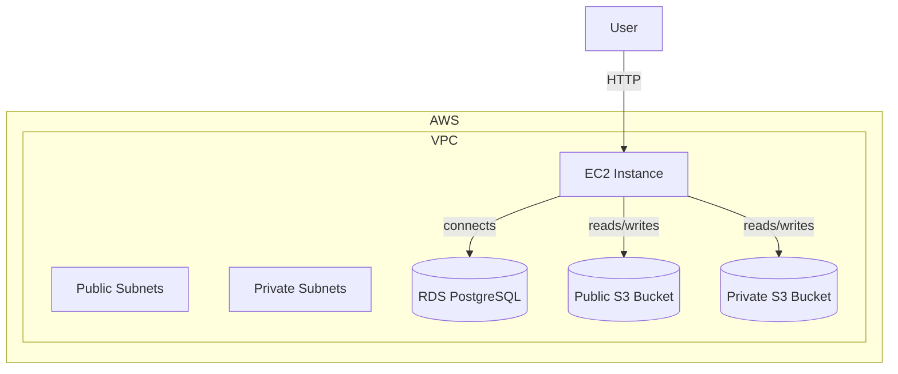

# BetterMe DevOps Test – Infrastructure

## Overview

This infrastructure deploys:
- **VPC** with public and private subnets
- **EC2 instance** to run the Node.js application (replacing EKS)
- **RDS PostgreSQL** instance (`db.t3.micro`)
- **Two S3 buckets**:
  - **Public** bucket for publicly accessible data via HTTP
  - **Private** bucket accessible only from within the VPC
- The application is deployed on **EC2 via Docker**

> ❗ Due to SSL certificate limitations (Cloudflare requires a paid plan for just [SSL issuing](https://community.cloudflare.com/t/using-cloudflare-only-for-custom-ssl-certificate-without-transferring-domain/660537), and ACM requires DNS management), **HTTPS via DuckDNS is currently not implemented**.

### Architecture



> __Note:__ Initially, EKS and Helm were planned for deployment, but due to certificate and DNS management issues, I switched to direct EC2 + Docker.

### Why SSL Certificates Were Skipped
- __DuckDNS__: Free, but does not support automated valid SSL certificates.
- __Cloudflare__: Free plan does not allow creating custom SSL without full domain control. (Cannot be implemented due to DuckDNS management part)
- __ACM (AWS Certificate Manager)__: Requires full control of DNS.

> Note that this repo uses pre-commit hooks to format and validate the code. To install pre-commit run `brew install pre-commit` and then run `pre-commit install`. After that

## How To Run this Code

To deploy the infrastructure, follow these steps:

 **Create a Terraform variables file** (e.g., `terraform.tfvars`) with minimal required values:

```hcl
aws_access_key = ""

aws_secret_key = ""
```

All other variables have default values and can be modified if needed.

Ensure you have AWS access for the account/region you want to deploy into.

Make sure you use your credentials when applying the changes.

``` hcl
terraform apply -var-file="terraform.tfvars
```