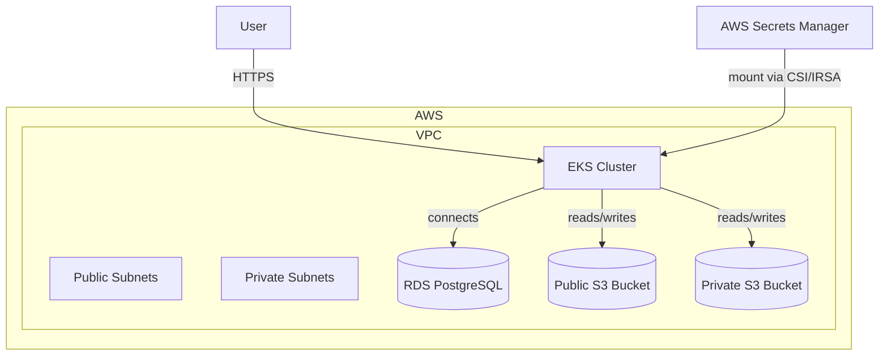

# BetterMe DevOps test – Infrastructure (WIP)

⚠ **Status:** Work In Progress (WIP)  
This project is still under active development.  
Terraform `apply` for the AWS infrastructure takes **30+ minutes** for each change which makes rapid testing slow.  
The current state is **not fully tested** – all components are drafts for illustration purposes.

## Overview

This infrastructure deploys:
- **VPC** with public and private subnets
- **Amazon EKS** cluster (private subnets)
- **RDS PostgreSQL** instance (`db.t3.micro`)
- **Two S3 buckets**:
  - **Public** bucket for publicly accessible data over HTTPS
  - **Private** bucket accessible only from within the VPC
- **AWS Secrets Manager** for database and AWS credentials
- Application deployed via **Helm** chart

The application:
- Runs a Node.js service from:

