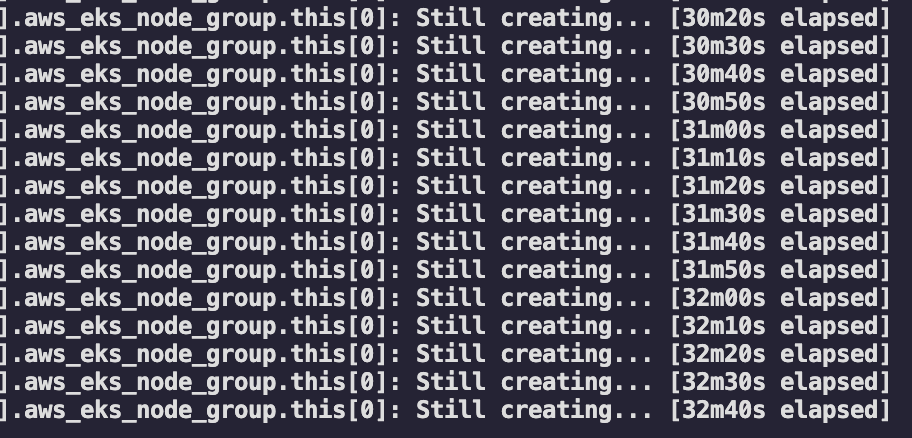
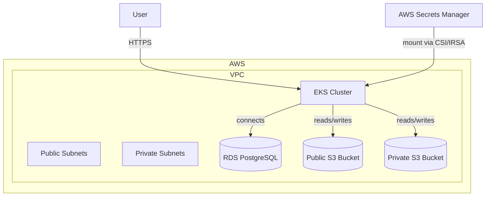

# BetterMe DevOps test – Infrastructure (WIP)

⚠ **Status:** Work In Progress (WIP)
This project is still under active development.
Terraform `apply` for the AWS infrastructure takes **30+ minutes** for each change which makes rapid testing slow.
The current state is **not fully tested** – all components are drafts for illustration purposes.

## Overview

This infrastructure deploys:
- **VPC** with public and private subnets
- **Amazon EKS** cluster (private subnets)
- **RDS PostgreSQL** instance (`db.t3.micro`)
- **Two S3 buckets**:
  - **Public** bucket for publicly accessible data over HTTPS
  - **Private** bucket accessible only from within the VPC
- **AWS Secrets Manager** for database and AWS credentials
- Application deployed via **Helm** chart

The application:
- Runs a Node.js service from:

>> Note that this repo uses pre-commit hooks to format and validate the code. To install pre-commit run `brew install pre-commit` and then run `pre-commit install`. After that

<!-- BEGIN_TF_DOCS -->
## Requirements

| Name | Version |
|------|---------|
|  [terraform](#requirement\_terraform) | ~> 1.3 |
|  [aws](#requirement\_aws) | >= 6.5.0 |
|  [cloudinit](#requirement\_cloudinit) | ~> 2.3.4 |
|  [helm](#requirement\_helm) | ~> 2.12.0 |
|  [random](#requirement\_random) | ~> 3.6.1 |
|  [tls](#requirement\_tls) | ~> 4.0.5 |

## Providers

| Name | Version |
|------|---------|
|  [aws](#provider\_aws) | 6.8.0 |
|  [helm](#provider\_helm) | 2.12.1 |
|  [random](#provider\_random) | 3.6.3 |

## Modules

| Name | Source | Version |
|------|--------|---------|
|  [app\_irsa](#module\_app\_irsa) | terraform-aws-modules/iam/aws//modules/iam-assumable-role-with-oidc | 5.39.0 |
|  [eks](#module\_eks) | terraform-aws-modules/eks/aws | 21.0.9 |
|  [irsa-ebs-csi](#module\_irsa-ebs-csi) | terraform-aws-modules/iam/aws//modules/iam-assumable-role-with-oidc | 5.39.0 |
|  [private\_s3](#module\_private\_s3) | terraform-aws-modules/s3-bucket/aws | ~> 5.4.0 |
|  [public\_s3](#module\_public\_s3) | terraform-aws-modules/s3-bucket/aws | ~> 5.4.0 |
|  [vpc](#module\_vpc) | terraform-aws-modules/vpc/aws | 6.0.1 |

## Resources

| Name | Type |
|------|------|
| [aws_db_instance.postgres](https://registry.terraform.io/providers/hashicorp/aws/latest/docs/resources/db_instance) | resource |
| [aws_db_subnet_group.postgres_subnet_group](https://registry.terraform.io/providers/hashicorp/aws/latest/docs/resources/db_subnet_group) | resource |
| [aws_secretsmanager_secret.db_credentials](https://registry.terraform.io/providers/hashicorp/aws/latest/docs/resources/secretsmanager_secret) | resource |
| [aws_secretsmanager_secret_version.db_credentials_version](https://registry.terraform.io/providers/hashicorp/aws/latest/docs/resources/secretsmanager_secret_version) | resource |
| [aws_security_group.postgres_sg](https://registry.terraform.io/providers/hashicorp/aws/latest/docs/resources/security_group) | resource |
| [aws_vpc_endpoint.s3](https://registry.terraform.io/providers/hashicorp/aws/latest/docs/resources/vpc_endpoint) | resource |
| [helm_release.betterme_app](https://registry.terraform.io/providers/hashicorp/helm/latest/docs/resources/release) | resource |
| [random_password.db_password](https://registry.terraform.io/providers/hashicorp/random/latest/docs/resources/password) | resource |
| [random_string.suffix](https://registry.terraform.io/providers/hashicorp/random/latest/docs/resources/string) | resource |
| [aws_availability_zones.available](https://registry.terraform.io/providers/hashicorp/aws/latest/docs/data-sources/availability_zones) | data source |
| [aws_eks_cluster_auth.cluster](https://registry.terraform.io/providers/hashicorp/aws/latest/docs/data-sources/eks_cluster_auth) | data source |
| [aws_iam_policy.ebs_csi_policy](https://registry.terraform.io/providers/hashicorp/aws/latest/docs/data-sources/iam_policy) | data source |

## Inputs

| Name | Description | Type | Default | Required |
|------|-------------|------|---------|:--------:|
|  [candidate\_name](#input\_candidate\_name) | Candidate name | `string` | `"anna"` | no |
|  [region](#input\_region) | AWS region | `string` | `"us-east-2"` | no |

## Outputs

| Name | Description |
|------|-------------|
|  [cluster\_endpoint](#output\_cluster\_endpoint) | Endpoint for EKS control plane |
|  [cluster\_name](#output\_cluster\_name) | Kubernetes Cluster Name |
|  [cluster\_security\_group\_id](#output\_cluster\_security\_group\_id) | Security group ids attached to the cluster control plane |
|  [region](#output\_region) | AWS region |
<!-- END_TF_DOCS -->
