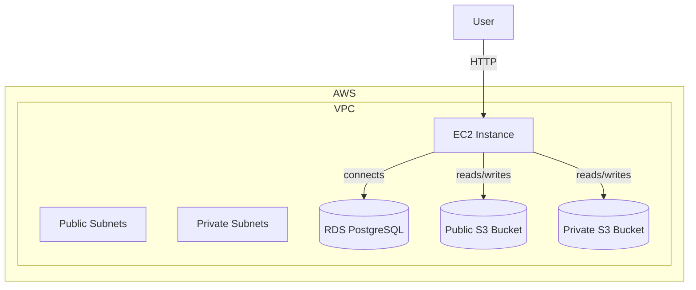
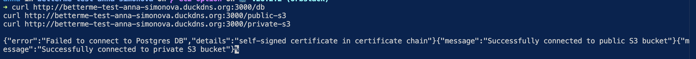

# BetterMe DevOps Test – Infrastructure

## Overview

This infrastructure deploys:
- **VPC** with public and private subnets
- **EC2 instance** to run the Node.js application (replacing EKS)
- **RDS PostgreSQL** instance (`db.t3.micro`)
- **Two S3 buckets**:
  - **Public** bucket for publicly accessible data via HTTP
  - **Private** bucket accessible only from within the VPC
- The application is deployed on **EC2 via Docker**

> ❗ Due to SSL certificate limitations (Cloudflare requires a paid plan for just [SSL issuing](https://community.cloudflare.com/t/using-cloudflare-only-for-custom-ssl-certificate-without-transferring-domain/660537), and ACM requires DNS management), **HTTPS via DuckDNS is currently not implemented**.

### Architecture



> __Note:__ Initially, EKS and Helm were planned for deployment, but due to certificate and DNS management issues, I switched to direct EC2 + Docker.

### Why SSL Certificates Were Skipped
- __DuckDNS__: Free, but does not support automated valid SSL certificates.
- __Cloudflare__: Free plan does not allow creating custom SSL without full domain control. (Cannot be implemented due to DuckDNS management part)
- __ACM (AWS Certificate Manager)__: Requires full control of DNS.

> Note that this repo uses pre-commit hooks to format and validate the code. To install pre-commit run `brew install pre-commit` and then run `pre-commit install`. After that

## How To Run this Code

To deploy the infrastructure, follow these steps:

 **Create a Terraform variables file** (e.g., `terraform.tfvars`) with minimal required values:

```hcl
aws_access_key = ""

aws_secret_key = ""
```

All other variables have default values and can be modified if needed.

Ensure you have AWS access for the account/region you want to deploy into.

Make sure you use your credentials when applying the changes.

``` hcl
terraform apply -var-file="terraform.tfvars
```

After that you can check the availability of your resources:

```bash
curl http://betterme-test-anna-simonova.duckdns.org:3000/db
curl http://betterme-test-anna-simonova.duckdns.org:3000/public-s3
curl http://betterme-test-anna-simonova.duckdns.org:3000/private-s3
```

The output should display success:


<!-- BEGIN_TF_DOCS -->
## Requirements

| Name | Version |
|------|---------|
| <a name="requirement_terraform"></a> [terraform](#requirement\_terraform) | >= 1.3.0 |
| <a name="requirement_aws"></a> [aws](#requirement\_aws) | ~> 6.5 |

## Providers

| Name | Version |
|------|---------|
| <a name="provider_random"></a> [random](#provider\_random) | 3.7.2 |

## Modules

| Name | Source | Version |
|------|--------|---------|
| <a name="module_db"></a> [db](#module\_db) | terraform-aws-modules/rds/aws | n/a |
| <a name="module_ec2"></a> [ec2](#module\_ec2) | terraform-aws-modules/ec2-instance/aws | n/a |
| <a name="module_private_s3_bucket"></a> [private\_s3\_bucket](#module\_private\_s3\_bucket) | terraform-aws-modules/s3-bucket/aws | 5.5.0 |
| <a name="module_public_s3_bucket"></a> [public\_s3\_bucket](#module\_public\_s3\_bucket) | terraform-aws-modules/s3-bucket/aws | 5.5.0 |
| <a name="module_vpc"></a> [vpc](#module\_vpc) | terraform-aws-modules/vpc/aws | n/a |

## Resources

| Name | Type |
|------|------|
| [random_password.db_password](https://registry.terraform.io/providers/hashicorp/random/latest/docs/resources/password) | resource |

## Inputs

| Name | Description | Type | Default | Required |
|------|-------------|------|---------|:--------:|
| <a name="input_aws_access_key"></a> [aws\_access\_key](#input\_aws\_access\_key) | AWS access key | `string` | n/a | yes |
| <a name="input_aws_secret_key"></a> [aws\_secret\_key](#input\_aws\_secret\_key) | AWS secret key | `string` | n/a | yes |
| <a name="input_candidate_name"></a> [candidate\_name](#input\_candidate\_name) | Candidate name | `string` | `"anna"` | no |
| <a name="input_environment"></a> [environment](#input\_environment) | Environment | `string` | `"test"` | no |
| <a name="input_ip_cidr"></a> [ip\_cidr](#input\_ip\_cidr) | IP CIDR | `string` | `"0.0.0.0/0"` | no |
| <a name="input_project_name"></a> [project\_name](#input\_project\_name) | Project name | `string` | `"betterme"` | no |
| <a name="input_region"></a> [region](#input\_region) | AWS region | `string` | `"us-east-2"` | no |

## Outputs

| Name | Description |
|------|-------------|
| <a name="output_db_endpoint"></a> [db\_endpoint](#output\_db\_endpoint) | n/a |
| <a name="output_db_password"></a> [db\_password](#output\_db\_password) | n/a |
| <a name="output_db_username"></a> [db\_username](#output\_db\_username) | n/a |
<!-- END_TF_DOCS -->
